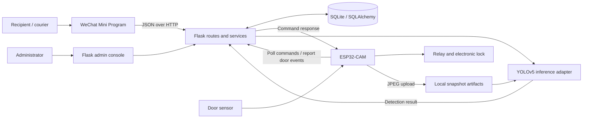
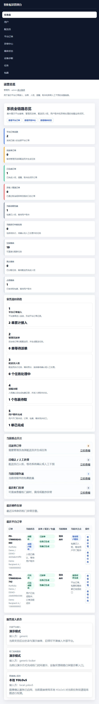

# Smart Food Delivery Locker

[](https://github.com/tuzzzzi/smart-food-delivery-locker/actions/workflows/checks.yml)

A WeChat Mini Program and Python/Flask backend for coordinating food delivery, locker access and recipient pickup, with ESP32-CAM firmware and a YOLOv5 snapshot-inference adapter.

**Python · Flask · SQLAlchemy · SQLite · JavaScript · WXML/WXSS · ESP32-CAM · YOLOv5**

**Author:** [tuzzzzi](https://github.com/tuzzzzi) · Independently developed academic project.

The core engineering problem is keeping an order, a delivery task, a physical locker and a package record consistent as a courier deposits an item and its recipient collects it.

## My contribution

I independently designed and implemented the WeChat Mini Program, Flask backend, database models, administration interface and ESP32-CAM integration. My work connected courier delivery, locker commands and door-sensor feedback with package records and recipient pickup. I also integrated the existing YOLOv5 framework into the snapshot-verification workflow; the model architecture is credited to Ultralytics.

## At a glance

| Layer | Implementation |
| --- | --- |
| Recipient and courier client | WeChat Mini Program: login, courier approval, task handling, order verification, pickup and reminders |
| Application server | Flask route modules and service layer for orders, tasks, packages, users and device events |
| Persistence | SQLAlchemy models backed by SQLite |
| Operations console | Server-rendered admin pages for dispatch, locker status, exceptions and event inspection |
| Device | ESP32-CAM polls commands, pulses a relay, observes a door sensor and uploads JPEG snapshots |
| Vision | A Python adapter invokes external YOLOv5 `detect.py` and converts detections into a structured result |

**Status:** academic prototype with application code, ESP32-CAM firmware and a host-side vision adapter. The quickstart below demonstrates the backend workflow without hardware: device feedback is simulated and the detector result is explicitly stubbed. The [hardware and real-inference setup](docs/setup.md) is documented separately.

## System architecture



The database records business and device state. The camera supplies images to the backend; YOLOv5 runs in a Python environment on the host, not on the ESP32.

## Engineering highlights

- **An explicit delivery lifecycle.** Platform orders become courier tasks; successful deposit verification creates a package and pickup code; pickup completes the order and releases its locker.
- **Device events tied to business records.** Locker commands and events retain task/package context, door progress, timeout state and diagnostic information. See [locker_gateway.py](backend/services/locker_gateway.py).
- **Recipient and courier ownership checks.** Guarded routes compare the request identity with the assigned courier or package recipient. See [guards.py](backend/routes/guards.py) and [user.py](backend/routes/user.py). Authentication itself is still a prototype; see [limitations](docs/limitations.md).
- **Vision errors remain distinct from missing packages.** The adapter distinguishes a pending snapshot, missing runtime/weights, detector failure and a completed detection with no target. See [ai_gateway.py](backend/services/ai_gateway.py).
- **Operator visibility.** The admin console surfaces orders, package states, locker events and exceptions instead of relying only on device logs.

## Preview

The original interface is in Chinese. The screenshot below is captured from the running application using newly generated synthetic records: one completed order and one package awaiting pickup. The door cycle and detection result in these records are simulated.

<details>
<summary>View the running administration dashboard</summary>



</details>

## Run the software demo

Use Python 3.11 or 3.12. No GPU is needed for this walkthrough.

**Windows PowerShell**, from the repository root:

```powershell
python -m venv .venv
.\.venv\Scripts\python.exe -m pip install -r backend/requirements.txt
Copy-Item .env.example .env
cd backend
..\.venv\Scripts\python.exe demo.py
..\.venv\Scripts\python.exe demo.py --leave-ready
..\.venv\Scripts\python.exe app.py
```

**macOS / Linux**, from the repository root:

```bash
python3 -m venv .venv
.venv/bin/python -m pip install -r backend/requirements.txt
cp .env.example .env
cd backend
../.venv/bin/python demo.py
../.venv/bin/python demo.py --leave-ready
../.venv/bin/python app.py
```

Open **http://127.0.0.1:5000/admin/login** and select the **Admin** demo identity. Explore the dashboard, platform orders, lockers and packages. `demo.py` runs the complete software path; `--leave-ready` leaves a second package awaiting pickup for inspection. Each invocation adds a synthetic order to the local database.

The walkthrough uses Flask's test client to execute the actual route handlers and database changes. It patches only the vision result and uses the existing mock locker mode. Running `app.py` alone does **not** silently turn real inference into a mock.

This application is for local demonstration. Keep the default loopback binding. Details for [WeChat, hardware and real inference](docs/setup.md) are separate from the software walkthrough.

## Verify the software

From `backend/`, using the virtual environment's Python:

```bash
python -m unittest discover -s tests -v
```

The tests use an isolated temporary SQLite database. They check:

1. Admin pages require a recognised identity.
2. A courier cannot read another courier's task.
3. A missing snapshot remains pending and creates no package.
4. Delivery and pickup update package, order and locker state; repeated pickup is rejected.
5. Another recipient cannot collect the package.

GitHub Actions configuration is included for these checks and JavaScript syntax validation. See [verification notes](docs/verification.md) for what was executed locally and what remains unverified.

## Repository map

```text
backend/                 Flask app, models, routes, services and admin UI
  demo.py                Synthetic software walkthrough
  tests/                 Isolated workflow and ownership checks
frontend/                WeChat Mini Program
hardware/esp32/           Locker controller and camera collection sketches
ai/inference/            Adapter for external YOLOv5 inference
docs/                    Architecture, setup, API map and verification notes
.env.example             Local configuration template
```

Start with [architecture and lifecycle](docs/architecture.md), the [API map](docs/api.md), or the [device sketch](hardware/esp32/locker_cam_poller/locker_cam_poller.ino).

## Scope and attribution

This repository contains the application, device firmware and inference-integration code. Object detection uses the external [Ultralytics YOLOv5 project](https://github.com/ultralytics/yolov5). Model source, weights, training datasets and private runtime records are excluded from the public snapshot.

External delivery-platform callbacks and SMS are demonstration/reserved integrations. Authentication and device endpoints retain prototype assumptions, so this repository is intended for local demonstration. See [limitations](docs/limitations.md) for deployment requirements and unverified paths, and [third-party notices](THIRD_PARTY_NOTICES.md) for attribution.

This public snapshot excludes local credentials, databases and development artifacts; the original local development history is maintained separately.
