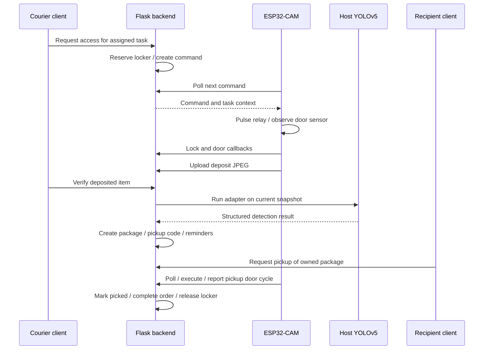

# Architecture and lifecycle

## Application boundaries

`frontend/` is a WeChat Mini Program, using JavaScript, WXML and WXSS. It is not a browser SPA. The admin console is a separate Flask/Jinja web interface with HTML and CSS.

`backend/routes/` handles requests. `backend/services/` coordinates ownership, dispatch, physical access, inference, audit records and reminders. `backend/models.py` defines the persistent entities, including `PlatformOrder`, `Task`, `Package`, `Box`, `LockerCommand` and `LockerEvent`.

SQLite is suitable for the local prototype. Allocation uses application queries and commits; concurrent multi-process locker allocation is not established by this repository's tests.

## Deposit to pickup

The diagram describes the hardware path. Mock locker mode emits the corresponding simulated lifecycle without an ESP32. The software walkthrough separately supplies a simulated successful vision result.

## State and failure handling

- `Box`: empty, reserved and occupied states connect availability to the task/package lifecycle.
- `Task`: assignment progresses to `waiting_ai`; verification may produce `ai_passed` or `ai_failed`.
- `Package`: a pending package becomes picked when the pickup workflow completes.
- `LockerCommand` / `LockerEvent`: command IDs connect device callbacks, timestamps, snapshots and business records. Timeout processing and diagnostic views support investigation.
- A missing snapshot is retryable; a missing inference runtime is an operational failure. Neither should be presented as successful detection.

Firmware persists the last executed command ID with ESP32 Preferences, checks executable command status and debounces the door input. These mechanisms support retry handling, but do not constitute a formal exactly-once guarantee.

## Useful entry points

| Concern | Source |
| --- | --- |
| ORM entities and relationships | `backend/models.py` |
| Dispatch and order state | `backend/services/platform_flow.py` |
| Locker commands, events and timeouts | `backend/services/locker_gateway.py` |
| Recipient resolution | `backend/services/ownership.py` |
| Inference subprocess and error mapping | `backend/services/ai_gateway.py` |
| YOLOv5 CLI wrapper | `ai/inference/detect_snapshot.py` |
| Polling, relay control and sensor callbacks | `hardware/esp32/locker_cam_poller/locker_cam_poller.ino` |

Database timestamps retain the original project's UTC storage conventions; UI display uses Asia/Shanghai in `backend/utils/time_utils.py`.
